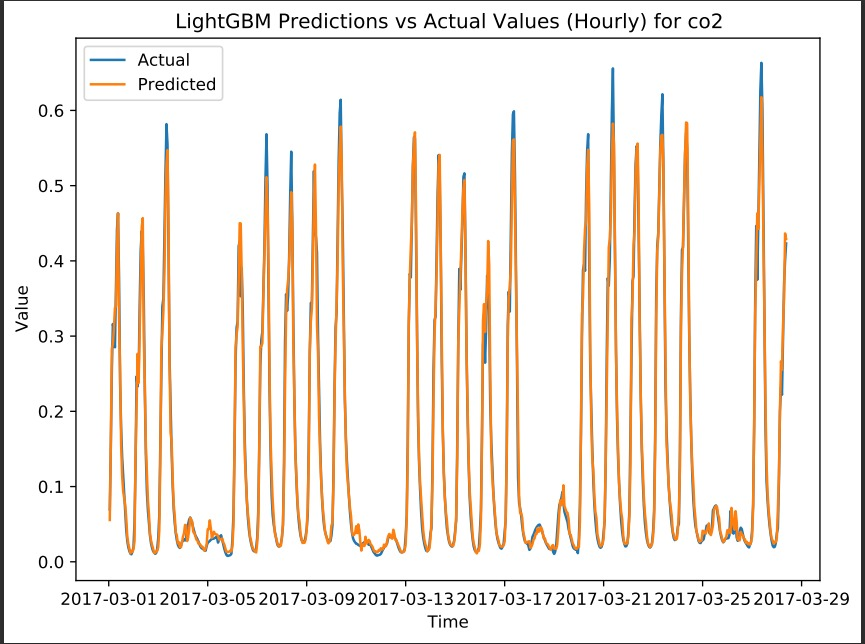

# Indoor Air Quality Prediction

This project uses machine learning models and LSTM networks to predict the future values of indoor air pollutants.

## Table of Contents

* [Installation](#installation)
* [Usage](#usage)
* [Results](#results)
* [License](#license)

## Installation

To install the required packages for this project, switch to a new environment. clone the repository using 


```sh
git clone https://github.com/en-ashay/Airquality-predction

## switch to the folder 
cd Airquality-prediction

```
then  run the following command:

```sh
pip install -r requirements.txt
```

## Usage

The repository contains a python script file  alongwith three Jupyter Notebooks: `EDA.ipynb`, `feature_engineering.ipynb`, and `time_series_forecasting.ipynb`and a folder for the PLots.

1. The `EDA.ipynb` notebook contains our exploratory data analysis (EDA), where we examine the data to uncover patterns and relationships. We use visualizations to present our findings and gain insights into the data.

2. In the `feature_engineering.ipynb` notebook, we generate new features to improve our predictive models. These include window features, which capture trends and patterns over a specified time window; time lag features, which incorporate past observations into our models; and seasonality and cyclical features, which account for recurring patterns in the data.

3. The `time_series_forecasting.ipynb` notebook contains our analysis of eight different time series forecasting models. We use grid search to systematically explore different combinations of model parameters and identify the best-performing models for each feature. The training history is saved as a CSV file for future reference. Additionally, we generate plots comparing real versus predicted values for all models and all features, which are stored in a plots folder for easy access.

4. Instead of the `time_series_forecasting.ipynb` , the `main.py` file can be used to run all the models and save the plots and the model results in the `results.json` file.

5.The `Plots` folder stores all the plots made during the `main.py` for all pollutants and also during the EDA process.
To run all models on the preprocessed data -

```sh
python main.py
```
## Results

The best performing models for each feature are:

| Pollutant | Model | MSE | MAPE |
| --- | --- | --- | --- |
| CO2 | LightGBM | 0.0003834291266491532 | 0.0960325396742516 % |
| Humidity | SVR | 5.930342021103925e-05 | 0.01851282401967276 % |
| PM10 | XGBoost | 2.649203592035359e-05 | 0.041401718434739304 % |
| PM25 | XGBoost | 6.058677648190005e-05 | 0.03985426224063079 % |
| Temperature | SVR | 0.0002899542450183089 | 0.026371552642149455 % |
| VOC | SVR | 0.00043322552369807647 | 3.195298841037611 % |


The top three performing models for different pollutant values are:

| Feature     | Best Performing Models |
|-------------|------------------------|
| CO2         | LightGBM, RandomForest, XGBoost |
| Humidity    | SVR, LightGBM, XGBoost |
| PM10        | LightGBM, RandomForest, XGBoost |
| PM2.5       | XGBoost, LightGBM, RandomForest |
| Temperature | SVR, RandomForest, LightGBM |
| VOC         | SVR, LightGBM , RandomForest


for example here is the prediction on CO2 values by LightGBM model
<!--  -->
<p align="center">
  
</p>
## License

This project is licensed under the MIT License - see the [LICENSE](LICENSE) file for detail
